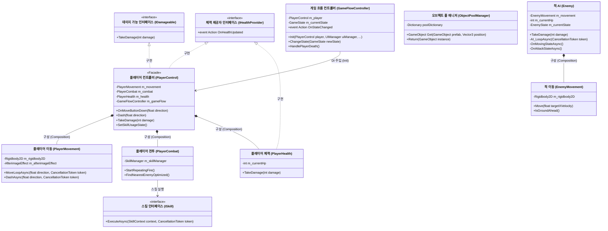
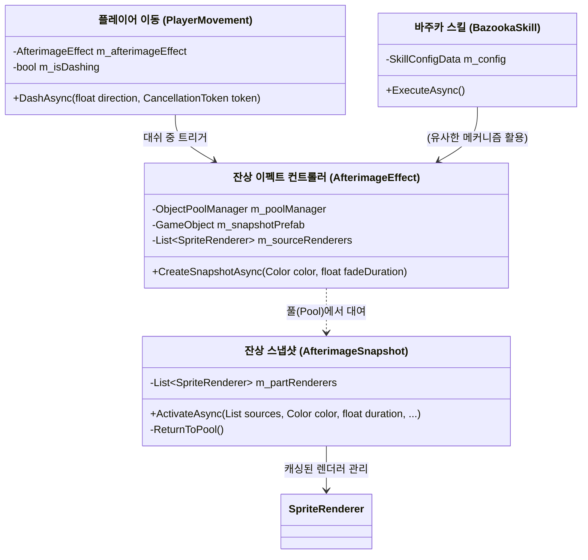

# OniBow: 2D Side-Scrolling Action Game

`OniBow`는 WebGL 및 Android 환경에 최적화된 고성능 2D 횡스크롤 액션 게임입니다.
플레이어는 다양한 스킬과 고난도 이동 기술(대쉬, 점프)을 활용하여 적과 전투를 벌이며 클리어해 나갑니다.

본 프로젝트는 단순한 기능 구현을 넘어, **UniTask를 활용한 비동기 상태 관리 최적화**, **VContainer를 통한 의존성 주입(DI)**, 그리고 수학적 알고리즘을 통한 독자적인 물리 효과(베지에 곡선 투사체, 유도 미사일, 행렬 기반 잔상 이펙트) 구현에 중점을 두었습니다. 

---

## 📝 목차 (Table of Contents)

*   [프로젝트 개요 (Overview)](#-프로젝트-개요-overview)
*   [주요 기능 (Key Features)](#-주요-기능-key-features)
*   [클래스 다이어그램 및 아키텍처](#-클래스-다이어그램-및-아키텍처)
*   [기술적 구현 (Technical Implementation)](#-기술적-구현-technical-implementation)
*   [빌드 및 실행 (Build & Run)](#-빌드-및-실행-build--run)

---

## 📖 프로젝트 개요 (Overview)

| 항목 | 내용 |
| :--- | :--- |
| **Engine** | Unity 6 |
| **Language** | C# |
| **Platform** | WebGL, Android |
| **Key Tech** | UniTask, DOTween, VContainer (DI), Object Pooling |
| **Architecture** | Component-based Facade (Player Control), Async FSM (Enemy AI), MVVM (UI) |

---

## ✨ 주요 기능 (Key Features)

### 🎮 Gameplay
*   **Dynamic Action**: 이동, 대쉬(잔상 효과 포함), 자동 공격 및 4종의 액티브 스킬(배리어, 힐, 추적 미사일, 바주카) 구현
*   **Advanced AI**: 플레이어 추적, 거리별 패턴 변경(원거리/근거리), 회피 기동이 가능한 비동기(UniTask) 기반 FSM 적 AI
*   **Combat System**: 타격감을 극대화하는 화면 쉐이크, 플로팅 데미지 텍스트, 체력 경고 비네트(Vignette) 효과

### ⚙️ System & Optimization
*   **Zero Allocation**: 런타임 가비지 컬렉션(GC)을 최소화하기 위해 콜백을 람다에서 명시적 메서드로 분리하고, 구조체 기반의 이벤트를 사용.
*   **Object Pooling**: 투사체, 다중 파츠 잔상 이펙트, 데미지 텍스트에 풀링 시스템을 적용하여 병목 차단.
*   **Resolution Management**: 다양한 디바이스 대응을 위한 16:9 고정 비율 및 레터박스/필러박스 자동 처리 (WebGL 최적화).

---

## 📐 클래스 다이어그램 및 아키텍처

### 1. 핵심 게임 로직 (Core Game Logic)
이 다이어그램은 `OniBow` 프로젝트의 핵심 게임 플레이 루프와 주요 컴포넌트 간의 상호작용을 나타냅니다.
싱글톤(Singleton) 패턴을 지양하고 VContainer를 통한 의존성 주입(DI)과 퍼사드(Facade) 패턴, 인터페이스 기반 설계를 준수하고 있습니다.



#### 아키텍처 주요 특징
1. **퍼사드(Facade) 패턴 (`PlayerControl`)**: 이동, 전투, 체력 로직을 각각 독립적인 컴포넌트로 분리하고, 외부(UI나 `GameFlowController`)에서는 `PlayerControl` 하나만을 통해 안전하게 상호작용합니다.
2. **비동기 상태 머신 (UniTask)**: `Enemy`의 `AI_LoopAsync` 및 `PlayerMovement.MoveLoopAsync`는 UniTask 기반 루프로 구현되어, 코루틴의 가비지 할당 없이 고성능의 논블로킹 업데이트 처리가 가능합니다.
3. **의존성 주입 (VContainer)**: 핵심 매니저 및 시스템(`GameFlowController` 등)은 싱글톤으로 직접 접근하지 않고 IoC 컨테이너를 통해 주입되어 결합도를 낮췄습니다.

### 2. 잔상(Afterimage) 이펙트 메커니즘
`OniBow` 프로젝트의 대쉬(Dash) 및 바주카 스킬 등에 사용되는 잔상 효과는 최적화와 시각적 품질을 고려하여 **행렬(Matrix) 연산**과 **비동기 트위닝(UniTask + DOTween)**의 조합으로 구현되었습니다.



#### 상호작용 흐름 예시 (Player Dash)
1. `PlayerControl`에서 `Dash()` 실행 시 `PlayerMovement.DashAsync()` 호출.
2. `DashAsync` 내부에서 이동 속도를 급격히 올리는 동안 루프를 통해 `AfterimageEffect.CreateSnapshotAsync()`를 일정 주기마다 호출.
3. `AfterimageEffect`는 풀에서 `AfterimageSnapshot`을 대여받고 속성(Color, 시간) 전달.
4. `AfterimageSnapshot`은 원본 캐릭터(`sourceRenderers`)의 현재 외형 행렬 값을 복사해 시각화 후 페이드 아웃 시작.
5. 대기열(UniTask.Delay) 종료 시 스스로 풀로 돌아감(ReturnToPool).

---

## 💻 기술적 구현 (Technical Implementation)

### 1. 2차 베지에 곡선을 이용한 투사체 제어
물리 엔진(Rigidbody)에 의존하지 않고, 수학적 공식을 통해 투사체의 궤적을 결정론적(Deterministic)으로 제어하여 정확한 타격감을 구현했습니다. `DOTween.To`를 활용하여 시간(t)에 따른 위치를 정밀하게 계산하고, 이동 방향에 맞춰 자연스럽게 회전시킵니다.

### 2. 행렬(Matrix) 연산을 활용한 다중 파츠 잔상 스냅샷 최적화
캐릭터의 잔상을 생성할 때, `Instantiate`의 오버헤드를 줄이고 `lossyScale`로 인한 오차를 해결하기 위해 행렬 연산을 도입했습니다. 원본의 다중 렌더러(SPUM 파츠 등) Transform을 잔상 컨테이너의 로컬 좌표계로 역산(`transform.worldToLocalMatrix * sourceRenderer.transform.localToWorldMatrix`)하여 매핑함으로써, 복잡한 계층 구조에 관계없이 정확하고 빠른 스냅샷을 생성합니다. 

### 3. UniTask와 CancellationToken을 활용한 안전한 비동기 FSM
UniTask를 사용하여 적(Enemy)과 플레이어(Player)의 행동 로직을 비동기 루프로 구현했습니다. `CancellationToken`을 도입하여 피격, 대쉬, 사망 등 상태가 급격히 변할 때 기존 비동기 작업을 즉시 안전하게 취소하고 새로운 상태로 전환합니다. 이를 통해 메모리 누수를 원천 차단했습니다.

### 4. 물리 기반 유도 미사일 조향 로직
타겟 방향 벡터에 수직인 벡터(`Vector2.Perpendicular`)와 사인 파(`Mathf.Sin`)를 결합하여, S자 곡선을 그리며 날아가는 자연스러운 물리 기반 유도 알고리즘을 구현했습니다.

---

## 🚀 빌드 및 실행 (Build & Run)

이 프로젝트는 Jenkins 파이프라인을 통해 WebGL 및 Android 빌드를 자동화할 수 있도록 `BuildScript.cs`를 구성하였습니다. 커맨드 라인 인자를 통해 빌드 타겟, 출력 경로, 빌드 옵션 등을 동적으로 제어할 수 있습니다.

### Command Line Build Usage (WebGL Example)
```bash
/path/to/Unity -quit -batchmode \
-projectPath . \
-executeMethod BuildScript.PerformBuild \
-buildTarget WebGL \
-outputPath "Builds/WebGL" \
-cleanBuild \
-logFile "build_webgl.log"
```
